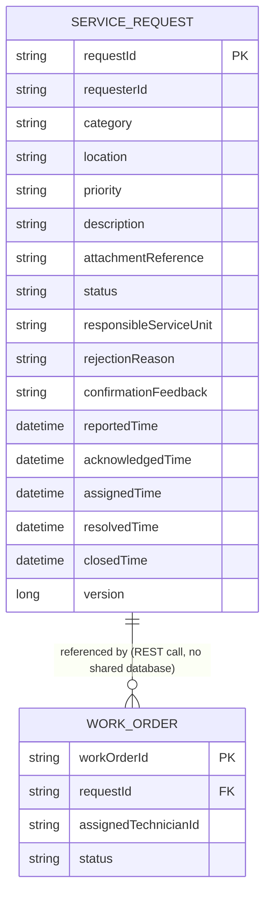
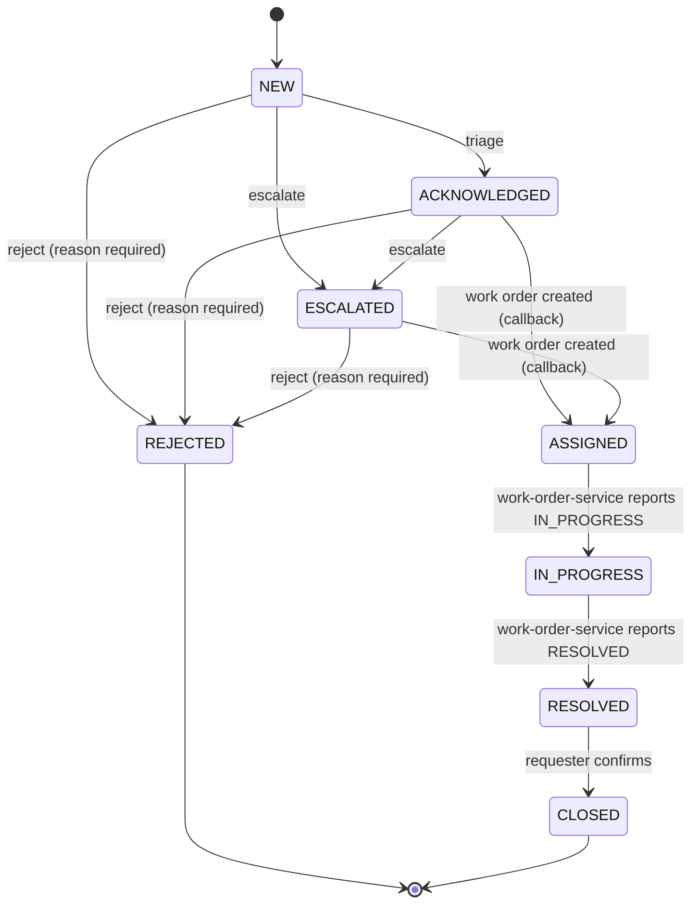

# service-request-service — Data Model & Lifecycle

## Entity-Relationship Diagram

`WorkOrder` lives in `work-order-service`'s own database (`work_order_db`); this service never queries it directly. The relationship above exists only through `work-order-service`'s REST callback into this service's internal status-update endpoint, consistent with the assignment's "never access another service database directly" rule.

## Status lifecycle (`RequestStatus`)

All status values are centralized in [`RequestStatus.java`](../service-request-service/src/main/java/com/usm/servicerequest/domain/RequestStatus.java) per guide §6.

### Enum Values

| Status | Category | Implemented Transitions | Notes |
| :--- | :--- | :--- | :--- |
| `NEW` | Initial | $\rightarrow$ `ACKNOWLEDGED`, `ESCALATED`, `REJECTED` | Initial state on request creation. |
| `ACKNOWLEDGED` | Active / Triaged | $\rightarrow$ `ASSIGNED`, `ESCALATED`, `REJECTED` | Triaged by Service Desk Officer. |
| `ESCALATED` | Active / Triaged | $\rightarrow$ `ASSIGNED`, `REJECTED` | Escalated to another unit; re-triage updates metadata while keeping `ESCALATED`. |
| `ASSIGNED` | Active / S2S | $\rightarrow$ `IN_PROGRESS` | Set via internal callback from `work-order-service`. |
| `IN_PROGRESS` | Active / S2S | $\rightarrow$ `RESOLVED` | Set via internal callback from `work-order-service`. |
| `RESOLVED` | Active / S2S | $\rightarrow$ `CLOSED` | Set via internal callback from `work-order-service`. |
| `CLOSED` | Terminal | None | Confirmed by original requester with feedback. |
| `REJECTED` | Terminal | None | Rejected by Service Desk Officer with mandatory reason. |
| `CANCELLED` | Side-branch | None (Pending Tech Lead review) | Defined in enum; no transition currently implemented. |

**Known limitation:** `RequestStatus.CANCELLED` is defined in `RequestStatus.java` (§6 side-branch) but no endpoint currently transitions a request into it. Wiring this status is pending an explicit decision from the team's Tech Lead regarding who may cancel (requester vs. service desk) and which states permit cancellation (e.g. before work order is `ASSIGNED` or `IN_PROGRESS`).

## Business rules enforced

- BR-01/BR-02: Endpoint access is restricted by role via `@PreAuthorize`.
- BR-05: `reject` requires a non-blank `rejectionReason` (enforced on DTO and defensively in service).
- BR-06: a request must be `ACKNOWLEDGED` or `ESCALATED` before a work order can be created against it (`ASSIGNED`).
- BR-09: every status-transition method stamps its corresponding timestamp in the same call (atomic).
- BR-10: a non-owner, non-privileged caller can only see their own requests.
