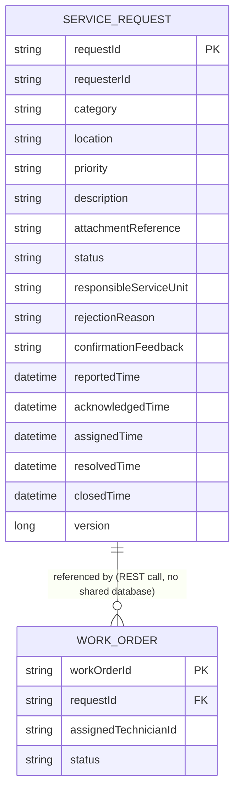
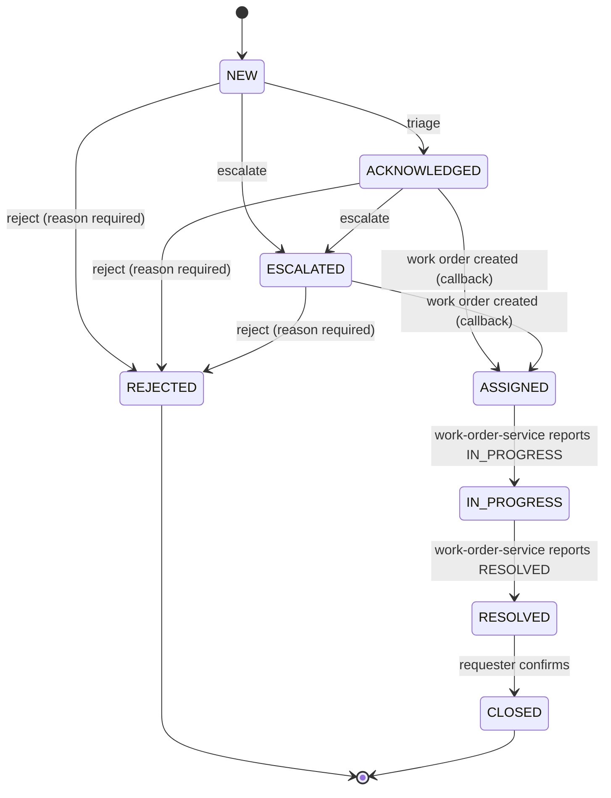

# service-request-service — Data Model & Lifecycle

## Entity-Relationship Diagram

```mermaid
erDiagram
    SERVICE_REQUEST {
        string requestId PK
        string requesterId
        string category
        string location
        string priority
        string description
        string attachmentReference
        string status
        string responsibleServiceUnit
        string rejectionReason
        string confirmationFeedback
        datetime reportedTime
        datetime acknowledgedTime
        datetime assignedTime
        datetime resolvedTime
        datetime closedTime
        long version
    }
    WORK_ORDER {
        string workOrderId PK
        string requestId FK
        string assignedTechnicianId
        string status
    }
    SERVICE_REQUEST ||--o{ WORK_ORDER : "referenced by (REST call, no shared database)"
```

`WorkOrder` lives in `work-order-service`'s own database (`work_order_db`); this service never queries it directly. The relationship above exists only through `work-order-service`'s REST callback into this service's internal status-update endpoint, consistent with the assignment's "never access another service database directly" rule.

## Status lifecycle (`RequestStatus`)

All status values are centralized in [`RequestStatus.java`](../service-request-service/src/main/java/com/usm/servicerequest/domain/RequestStatus.java) per guide §6.

### Enum Values

| Status | Category | Implemented Transitions | Notes |
| :--- | :--- | :--- | :--- |
| `NEW` | Initial | $\rightarrow$ `ACKNOWLEDGED`, `ESCALATED`, `REJECTED` | Initial state on request creation. |
| `ACKNOWLEDGED` | Active / Triaged | $\rightarrow$ `ASSIGNED`, `ESCALATED`, `REJECTED` | Triaged by Service Desk Officer. |
| `ESCALATED` | Active / Triaged | $\rightarrow$ `ASSIGNED`, `REJECTED` | Escalated to another unit; re-triage updates metadata while keeping `ESCALATED`. |
| `ASSIGNED` | Active / S2S | $\rightarrow$ `IN_PROGRESS` | Set via internal callback from `work-order-service`. |
| `IN_PROGRESS` | Active / S2S | $\rightarrow$ `RESOLVED` | Set via internal callback from `work-order-service`. |
| `RESOLVED` | Active / S2S | $\rightarrow$ `CLOSED` | Set via internal callback from `work-order-service`. |
| `CLOSED` | Terminal | None | Confirmed by original requester with feedback. |
| `REJECTED` | Terminal | None | Rejected by Service Desk Officer with mandatory reason. |
| `CANCELLED` | Side-branch | None (Pending Tech Lead review) | Defined in enum; no transition currently implemented. |

```mermaid
stateDiagram-v2
    [*] --> NEW
    NEW --> ACKNOWLEDGED: triage
    NEW --> ESCALATED: escalate
    ACKNOWLEDGED --> ESCALATED: escalate
    NEW --> REJECTED: reject (reason required)
    ACKNOWLEDGED --> REJECTED: reject (reason required)
    ESCALATED --> REJECTED: reject (reason required)
    ACKNOWLEDGED --> ASSIGNED: work order created (callback)
    ESCALATED --> ASSIGNED: work order created (callback)
    ASSIGNED --> IN_PROGRESS: work-order-service reports IN_PROGRESS
    IN_PROGRESS --> RESOLVED: work-order-service reports RESOLVED
    RESOLVED --> CLOSED: requester confirms
    REJECTED --> [*]
    CLOSED --> [*]
```

**Known limitation:** `RequestStatus.CANCELLED` is defined in `RequestStatus.java` (§6 side-branch) but no endpoint currently transitions a request into it. Wiring this status is pending an explicit decision from the team's Tech Lead regarding who may cancel (requester vs. service desk) and which states permit cancellation (e.g. before work order is `ASSIGNED` or `IN_PROGRESS`).

## Business rules enforced

- BR-01/BR-02: Endpoint access is restricted by role via `@PreAuthorize`.
- BR-05: `reject` requires a non-blank `rejectionReason` (enforced on DTO and defensively in service).
- BR-06: a request must be `ACKNOWLEDGED` or `ESCALATED` before a work order can be created against it (`ASSIGNED`).
- BR-09: every status-transition method stamps its corresponding timestamp in the same call (atomic).
- BR-10: a non-owner, non-privileged caller can only see their own requests.

## Backend API Specifications

Base URL: `http://localhost:8081`  
Controller: [`ServiceRequestController.java`](../src/main/java/com/usm/servicerequest/controller/ServiceRequestController.java)  
Auth Scheme: `Bearer <JWT>` passed in `Authorization` header.

### Endpoints Overview

| Method | Endpoint | Allowed Roles | Description |
| :--- | :--- | :--- | :--- |
| `POST` | `/api/service-requests` | `STUDENT`, `ACADEMIC_STAFF`, `ADMINISTRATIVE_STAFF` | Submit a new service request (US-01, FR-01) |
| `GET` | `/api/service-requests` | Authenticated users (ownership scoped via BR-10) | List service requests with optional filters |
| `GET` | `/api/service-requests/{id}` | Request Owner, `SERVICE_DESK_OFFICER`, `SERVICE` | Get full details of a specific service request |
| `PATCH` | `/api/service-requests/{id}/triage` | `SERVICE_DESK_OFFICER` | Classify category, priority, and assign unit |
| `PATCH` | `/api/service-requests/{id}/reject` | `SERVICE_DESK_OFFICER` | Reject request with mandatory reason (BR-05) |
| `PATCH` | `/api/service-requests/{id}/escalate` | `SERVICE_DESK_OFFICER` | Escalate request to a different service unit |
| `PATCH` | `/api/service-requests/{id}/confirm` | Request Owner (Original Requester only) | Confirm resolution and close request (US-12) |
| `PATCH` | `/api/service-requests/{id}/status` | `SERVICE` (Internal S2S only) | Callback from `work-order-service` |
| `GET` | `/api/service-requests/summary` | `SERVICE_DESK_OFFICER`, `ADMINISTRATIVE_STAFF` | Aggregated count metrics grouped by attribute |
| `POST` | `/api/dev/token` | Public (Only active when `usm.dev-tools.enabled=true`) | Mint test JWT tokens for local development |
| `GET` | `/actuator/health` | Public | Application health status indicator |
| `GET` | `/swagger-ui.html` | Public | Interactive OpenAPI / Swagger UI documentation |

---

### Detailed Endpoint Specifications

#### 1. Submit Request (`POST /api/service-requests`)
- **Controller**: `ServiceRequestController.create`
- **Security**: `@PreAuthorize("hasAnyRole('STUDENT','ACADEMIC_STAFF','ADMINISTRATIVE_STAFF')")`
- **Request Body** (`CreateServiceRequestRequest`):
  - `category` (`RequestCategory`, required): `FACILITY`, `EQUIPMENT`, `IT`, `GENERAL`
  - `location` (string, required, max 255 chars)
  - `priority` (`RequestPriority`, required): `LOW`, `MEDIUM`, `HIGH`, `CRITICAL` (Requester suggestion)
  - `description` (string, required)
  - `attachmentReference` (string, optional, max 500 chars)
- **Response**: `201 Created` returning `ServiceRequestResponse`
- **State on creation**: `status = NEW`, `reportedTime = current timestamp`, `requestId = REQ-YYYYMMDD-XXXX`.

#### 2. List Requests (`GET /api/service-requests`)
- **Controller**: `ServiceRequestController.list`
- **Security**: Authenticated user.
  - If caller is `SERVICE_DESK_OFFICER` or `SERVICE`: Can view all requests.
  - All other roles: Can only view requests where `requesterId == caller.userId` (BR-10).
- **Query Parameters**:
  - `requesterId` (string, optional): Filter by user (staff only).
  - `status` (`RequestStatus`, optional): Filter by status (`NEW`, `ACKNOWLEDGED`, etc.).
  - `category` (`RequestCategory`, optional): Filter by category.
- **Response**: `200 OK` returning `List<ServiceRequestResponse>`

#### 3. Get Request by ID (`GET /api/service-requests/{id}`)
- **Controller**: `ServiceRequestController.getById`
- **Security**: Caller must be request owner, `SERVICE_DESK_OFFICER`, or `SERVICE` (BR-10).
- **Response**: `200 OK` returning `ServiceRequestResponse`
- **Errors**: `404 Not Found` if request does not exist; `403 Forbidden` if caller lacks access.

#### 4. Triage Request (`PATCH /api/service-requests/{id}/triage`)
- **Controller**: `ServiceRequestController.triage`
- **Security**: `@PreAuthorize("hasRole('SERVICE_DESK_OFFICER')")`
- **Allowed States**: `NEW`, `ACKNOWLEDGED`, `ESCALATED`
- **Request Body** (`TriageRequest`):
  - `category` (`RequestCategory`, optional override)
  - `priority` (`RequestPriority`, optional override)
  - `responsibleServiceUnit` (string, required)
- **Behavior**: Transitions `NEW` $\rightarrow$ `ACKNOWLEDGED` and stamps `acknowledgedTime`. If already `ACKNOWLEDGED` or `ESCALATED`, updates fields and retains status.
- **Response**: `200 OK` returning `ServiceRequestResponse`

#### 5. Reject Request (`PATCH /api/service-requests/{id}/reject`)
- **Controller**: `ServiceRequestController.reject`
- **Security**: `@PreAuthorize("hasRole('SERVICE_DESK_OFFICER')")`
- **Allowed States**: `NEW`, `ACKNOWLEDGED`, `ESCALATED`
- **Request Body** (`RejectRequest`):
  - `rejectionReason` (string, required, non-blank)
- **Behavior**: Transitions to `REJECTED`, records reason, stamps timestamp (terminal state).
- **Response**: `200 OK` returning `ServiceRequestResponse`

#### 6. Escalate Request (`PATCH /api/service-requests/{id}/escalate`)
- **Controller**: `ServiceRequestController.escalate`
- **Security**: `@PreAuthorize("hasRole('SERVICE_DESK_OFFICER')")`
- **Allowed States**: `NEW`, `ACKNOWLEDGED`, `ESCALATED`
- **Request Body** (`EscalateRequest`):
  - `responsibleServiceUnit` (string, required, non-blank)
- **Behavior**: Transitions to `ESCALATED`, sets new unit, stamps timestamp.
- **Response**: `200 OK` returning `ServiceRequestResponse`

#### 7. Confirm Resolution and Close (`PATCH /api/service-requests/{id}/confirm`)
- **Controller**: `ServiceRequestController.confirm`
- **Security**: Authenticated original requester only (`caller.userId == requesterId`).
- **Allowed States**: `RESOLVED` only.
- **Request Body** (`ConfirmRequest`):
  - `confirmationFeedback` (string, optional, max 500 chars)
- **Behavior**: Transitions `RESOLVED` $\rightarrow$ `CLOSED`, records feedback, stamps `closedTime`.
- **Response**: `200 OK` returning `ServiceRequestResponse`
- **Errors**: `403 Forbidden` if not original requester; `400 Bad Request` if not `RESOLVED`.

#### 8. Internal Status Update (`PATCH /api/service-requests/{id}/status`)
- **Controller**: `ServiceRequestController.applyInternalStatusUpdate`
- **Security**: `@PreAuthorize("hasRole('SERVICE')")` (Internal S2S only; not for public API gateway).
- **Request Body** (`InternalStatusUpdateRequest`):
  - `status` (`RequestStatus`, required): Must be `ASSIGNED`, `IN_PROGRESS`, or `RESOLVED`.
- **Allowed Transitions**:
  - To `ASSIGNED`: Request must be `ACKNOWLEDGED` or `ESCALATED` (BR-06). Stamps `assignedTime`.
  - To `IN_PROGRESS`: Stamped into `IN_PROGRESS`.
  - To `RESOLVED`: Request must be `ASSIGNED` or `IN_PROGRESS`. Stamps `resolvedTime`.
- **Response**: `200 OK` returning `ServiceRequestResponse`

#### 9. Metrics Summary (`GET /api/service-requests/summary`)
- **Controller**: `ServiceRequestController.summary`
- **Security**: `@PreAuthorize("hasAnyRole('SERVICE_DESK_OFFICER','ADMINISTRATIVE_STAFF')")`
- **Query Parameters**:
  - `groupBy` (string, optional, default `"status"`): `status`, `category`, `priority`, `location`, `unit` / `responsibleServiceUnit`.
- **Response**: `200 OK` returning `SummaryResponse` (`{ "groupBy": "...", "counts": { "...": 4 } }`).

---

## Dependencies & Technical Stack

The service is built on Java 17 using Maven with `spring-boot-starter-parent` (`3.2.5`).

### Maven Dependencies (`pom.xml`)

| Dependency / Starter | Coordinates | Scope | Purpose |
| :--- | :--- | :--- | :--- |
| **Spring Boot Starter Web** | `org.springframework.boot:spring-boot-starter-web` | Compile | Embedded Tomcat, REST controllers, Spring MVC, Jackson JSON serialization |
| **Spring Boot Starter Data JPA** | `org.springframework.boot:spring-boot-starter-data-jpa` | Compile | Hibernate ORM, Spring Data repositories, HikariCP connection pooling |
| **Spring Boot Starter Validation** | `org.springframework.boot:spring-boot-starter-validation` | Compile | Bean validation annotations (`@NotNull`, `@NotBlank`, `@Size`) |
| **Spring Boot Starter Security** | `org.springframework.boot:spring-boot-starter-security` | Compile | Spring Security 6, stateless JWT filter chain, method security (`@PreAuthorize`) |
| **Spring Boot Starter Actuator** | `org.springframework.boot:spring-boot-starter-actuator` | Compile | Operational health endpoints (`/actuator/health`) and metrics |
| **MySQL Connector/J** | `com.mysql:mysql-connector-j` | Runtime | Official JDBC Driver for MySQL 8.0 connection |
| **Flyway Core** | `org.flywaydb:flyway-core` | Compile | Versioned database schema migrations (auto-applied from `db/migration`) |
| **Flyway MySQL** | `org.flywaydb:flyway-mysql` | Compile | MySQL dialect support for Flyway |
| **JJWT API** | `io.jsonwebtoken:jjwt-api:0.12.5` | Compile | Java JWT API interface for token parsing and signing |
| **JJWT Implementation** | `io.jsonwebtoken:jjwt-impl:0.12.5` | Runtime | JJWT HMAC-SHA signing and verification implementation |
| **JJWT Jackson** | `io.jsonwebtoken:jjwt-jackson:0.12.5` | Runtime | JSON serializer/deserializer bridge between JJWT and Jackson |
| **SpringDoc OpenAPI WebMVC UI** | `org.springdoc:springdoc-openapi-starter-webmvc-ui:2.5.0` | Compile | Generates OpenAPI 3.0 specs (`/v3/api-docs`) and interactive Swagger UI (`/swagger-ui.html`) |
| **H2 Database** | `com.h2database:h2` | Test | In-memory SQL database for unit/integration tests without running Docker MySQL |
| **Spring Boot Starter Test** | `org.springframework.boot:spring-boot-starter-test` | Test | JUnit 5 Jupiter, Mockito, AssertJ, and Spring Test runner |
| **Spring Security Test** | `org.springframework.security:spring-security-test` | Test | Test support for Spring Security contexts and `@WithMockUser` |

### External Systems & Architecture Dependencies

1. **MySQL 8.0**:
   - Primary persistent datastore (`service_request_db`). Flyway enforces schema migrations on startup with Hibernate configured with `ddl-auto: validate`.
2. **`work-order-service`**:
   - Sibling microservice (Backend Dev 2). Communicates asynchronously via REST: calls `PATCH /api/service-requests/{id}/status` using a service token (`role=SERVICE`). There is **no shared database** and no cross-schema joins.
3. **Identity & Access Management (Group 5)**:
   - External auth provider issuing JWT tokens. Currently simulated using a shared placeholder HMAC secret and a dev-only controller (`/api/dev/token`).
4. **Facility Service (Group 6)**:
   - Future external dependency for validating `location` values against university facility IDs.

